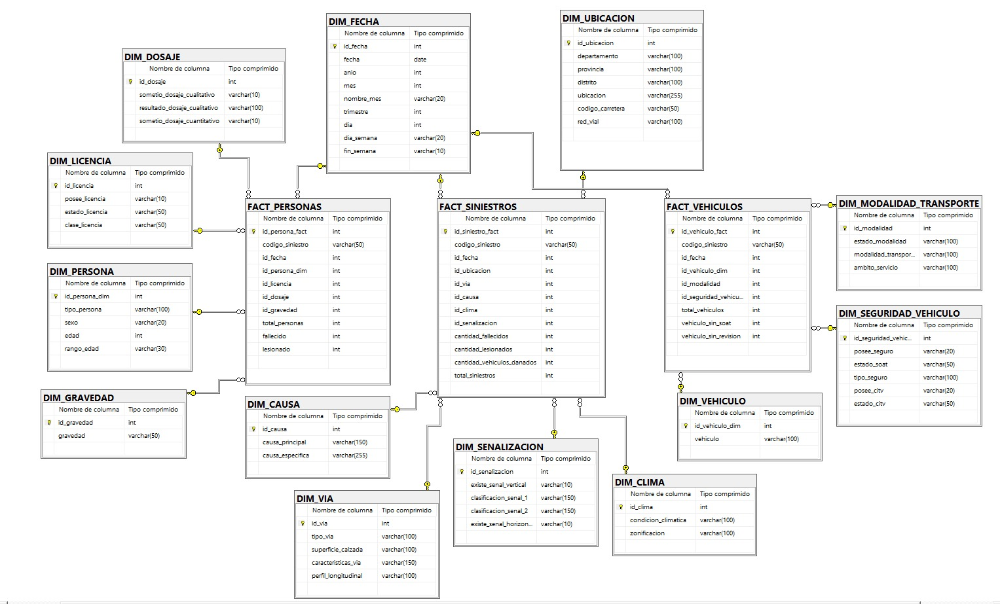

# Plataforma BI para el monitoreo de puntos críticos de siniestralidad vial en el Perú

# Integrantes:
- Alessandra Munayco
- Margot Torre
- Daniela Torres
- Milagros Valverde

## Descripción del proyecto

Este proyecto propone el diseño de una solución de Business Intelligence para el análisis de siniestros de tránsito fatales en el Perú, utilizando datos abiertos del Observatorio Nacional de Seguridad Vial del Ministerio de Transportes y Comunicaciones.

La propuesta se centra en la construcción de un Data Warehouse que permita integrar información sobre siniestros, personas involucradas y vehículos involucrados, con el objetivo de facilitar el análisis territorial, temporal y descriptivo de la siniestralidad vial fatal.

Las bases consideradas fueron: 
* Siniestros de tránsito fatales 2021-2025.
* Personas involucradas en siniestros de tránsito fatales 2021-2025.
* Vehículos involucrados en siniestros de tránsito fatales 2021-2025.

# 1. Contexto
La seguridad vial constituye uno de los ejes fundamentales de la gestión pública contemporánea, pues articula la movilidad urbana sostenible con la protección de la vida y la salud de la población. A nivel mundial, los siniestros de tránsito representan un problema de salud pública de primera magnitud: según la Organización Mundial de la Salud (OMS, 2023), aproximadamente 1,19 millones de personas pierden la vida cada año a causa de accidentes de tránsito, siendo estos la principal causa de muerte entre niños, adolescentes y jóvenes de 5 a 29 años. Estas cifras no solo reflejan una tragedia humana de proporciones alarmantes, sino que también revelan la urgencia de comprender con mayor precisión las circunstancias en que ocurren los siniestros y los factores que determinan su frecuencia y gravedad.

Las consecuencias de los accidentes de tránsito van mucho más allá de las pérdidas humanas. Generan costos económicos significativos vinculados a la atención médica, los procesos de rehabilitación, la pérdida de productividad laboral y los daños materiales; pero además producen un impacto social profundo que afecta la calidad de vida de las víctimas, sus familias y la comunidad en su conjunto. Esta dimensión multifactorial —donde confluyen la infraestructura vial, las características de los vehículos, las condiciones ambientales, el comportamiento de los conductores y las acciones de fiscalización— exige abordajes analíticos integrales y basados en evidencia.

En el Perú, la siniestralidad vial constituye un desafío estructural para las instituciones encargadas de la regulación, supervisión y gestión del tránsito. A los factores comunes en el ámbito internacional se suman elementos propios del contexto nacional: la informalidad en el transporte, la diversidad geográfica del territorio y las marcadas diferencias entre entornos urbanos y rurales. De acuerdo con el Ministerio de Transportes y Comunicaciones (MTC, 2024), la imprudencia del conductor y el exceso de velocidad figuran entre las principales causas de siniestros viales a nivel nacional. Esta complejidad se manifiesta también en los distintos contextos territoriales: en las zonas urbanas, la alta concentración vehicular expone permanentemente a peatones, motociclistas y pasajeros, mientras que en las carreteras interprovinciales y vías rurales predominan los riesgos asociados a velocidades elevadas, condiciones climáticas adversas, infraestructura precaria y menor capacidad de respuesta ante emergencias.

Frente a este escenario, el Estado peruano ha desarrollado mecanismos institucionales orientados a mejorar la gestión de la información sobre seguridad vial. El Ministerio de Transportes y Comunicaciones (MTC) es el organismo rector encargado de conducir las políticas nacionales en materia de transportes, tránsito, regulación del transporte terrestre, fiscalización y seguridad vial. En ese marco, creó el Observatorio Nacional de Seguridad Vial (ONSV), plataforma especializada cuya función es sistematizar, analizar y difundir información sobre los riesgos, causas y consecuencias de los siniestros viales, utilizando buenas prácticas en la gestión de datos, con la finalidad de servir como insumo para que las entidades competentes mejoren las políticas de prevención, fiscalización y respuesta frente a los hechos de tránsito (ONSV, s.f.).

Desde su implementación en 2021, el ONSV ha contribuido al registro georreferenciado y oportuno de los siniestros de tránsito con consecuencias fatales, permitiendo que las instituciones rectoras en materia de seguridad vial y los distintos niveles de gobierno cuenten con evidencia para diseñar acciones de prevención y fiscalización (MTC, 2024). Como parte de esta iniciativa, el Observatorio pone a disposición un portal de datos abiertos que contiene información sobre siniestros fatales, personas involucradas y vehículos asociados a nivel nacional durante el período 2021–2025, constituyendo una fuente oficial, real y de alto impacto para investigadores, instituciones públicas y tomadores de decisiones.
# 2. Descripción de la institución

El proyecto toma como institución de referencia al Ministerio de Transportes y Comunicaciones del Perú, entidad pública responsable de formular, dirigir y supervisar políticas relacionadas con el transporte, el tránsito, la infraestructura vial y la seguridad vial a nivel nacional.

Dentro de este marco institucional, el análisis se enfoca en el Observatorio Nacional de Seguridad Vial, plataforma especializada que recopila, sistematiza y difunde información sobre los siniestros de tránsito ocurridos en el país. Esta plataforma pone a disposición datos abiertos sobre siniestros fatales, personas involucradas y vehículos asociados, constituyéndose en una fuente relevante para el análisis de la seguridad vial en el Perú.

La información publicada por el Observatorio permite conocer la magnitud del problema y sirve como insumo para el diseño de políticas públicas, campañas de prevención, acciones de fiscalización y estrategias de mejora vial. Sin embargo, al encontrarse distribuida en bases separadas, requiere ser integrada y organizada en una estructura analítica que facilite su consulta e interpretación.

En ese sentido, el presente proyecto propone la creación de un Data Warehouse dimensional que consolide la información del Observatorio Nacional de Seguridad Vial en un modelo orientado al análisis. Esta solución busca mejorar el aprovechamiento de los datos disponibles y apoyar la identificación de puntos críticos de siniestralidad vial fatal.
# 3. Fuentes de datos

Para la construcción del Data Warehouse se utilizaron datos abiertos del **Observatorio Nacional de Seguridad Vial (ONSV)** del **Ministerio de Transportes y Comunicaciones (MTC)**, correspondientes al periodo **2021-2025**.

| Fuente de datos                    | Contenido principal                                                                                                                 | Uso en el Data Warehouse                                                                           |
| ---------------------------------- | ----------------------------------------------------------------------------------------------------------------------------------- | -------------------------------------------------------------------------------------------------- |
| **Siniestros de tránsito fatales** | Información del evento vial: fecha, ubicación, tipo de vía, causa, clima, señalización, fallecidos, lesionados y vehículos dañados. | Base para `FACT_SINIESTROS` y dimensiones como fecha, ubicación, vía, causa, clima y señalización. |
| **Personas involucradas**          | Información de las personas asociadas al siniestro: tipo de persona, sexo, edad, gravedad, licencia y dosaje etílico.               | Base para `FACT_PERSONAS` y dimensiones como persona, licencia, dosaje y gravedad.                 |
| **Vehículos involucrados**         | Información de los vehículos asociados al siniestro: tipo de vehículo, modalidad de transporte, SOAT, seguro y CITV.                | Base para `FACT_VEHICULOS` y dimensiones como vehículo, modalidad y seguridad vehicular.           |

Estas fuentes fueron integradas mediante el **código del siniestro**, permitiendo relacionar los eventos viales con las personas y vehículos involucrados para su posterior análisis en el dashboard.

**Fuente oficial:**
[Observatorio Nacional de Seguridad Vial - Datos abiertos](https://www.onsv.gob.pe/datosabiertos)

# 4. Problemática
El Observatorio Nacional de Seguridad Vial dispone de datos abiertos sobre siniestros de tránsito fatales, personas involucradas y vehículos involucrados. No obstante, esta información se encuentra distribuida en archivos independientes, lo que dificulta su análisis conjunto y limita la capacidad de obtener conclusiones integrales sobre el comportamiento de la siniestralidad vial en el Perú.

La base de siniestros contiene información del evento vial, como fecha, ubicación, causa, tipo de vía, condiciones climáticas y señalización. Por otro lado, la base de personas describe características de los involucrados, como tipo de persona, sexo, edad, gravedad, licencia y dosaje. Finalmente, la base de vehículos contiene información sobre tipo de vehículo, modalidad de transporte, SOAT y CITV. Aunque cada fuente aporta datos relevantes, su análisis por separado no permite comprender de manera completa la relación entre el evento, las personas y los vehículos asociados.

Esta fragmentación genera una brecha entre la disponibilidad de datos y su aprovechamiento para la toma de decisiones. En su estado original, los registros requieren cruces manuales, limpieza previa y procesos de interpretación que dificultan responder con rapidez preguntas clave como: qué departamentos, provincias o distritos concentran más siniestros fatales; qué tipos de vehículos aparecen con mayor frecuencia; qué características presentan las personas involucradas; qué causas son más recurrentes; y qué zonas deberían priorizarse para acciones de prevención o fiscalización.

Por ello, el problema central identificado es la falta de una estructura integrada de Business Intelligence que permita consolidar, depurar, modelar y visualizar la información de siniestros viales fatales. Esta ausencia limita la identificación de patrones críticos, la detección de tendencias y la generación de información accionable para la gestión de la seguridad vial.

Frente a esta problemática, el proyecto plantea el diseño e implementación de un Data Warehouse dimensional basado en un esquema galaxia, compuesto por tablas de hechos y dimensiones de análisis. Esta solución permite integrar las fuentes de siniestros, personas y vehículos en una estructura común, facilitando el análisis multidimensional y el desarrollo de dashboards interactivos para monitorear puntos críticos de siniestralidad vial fatal en el Perú.

# 5. Objetivos
## 5.1. Objetivo general
Diseñar e implementar un Data Warehouse de siniestralidad vial que consolide y estructure la información proveniente de las bases de datos del ONSV —siniestros fatales, personas involucradas y vehículos involucrados— en un modelo multidimensional orientado al análisis, para el período 2021–2025.
## 5.2. Objetivos específicos

- Integrar y depurar las fuentes de datos del ONSV correspondientes a siniestros fatales, personas involucradas y vehículos involucrados, mediante procesos de extracción, transformación y carga (ETL).
  
- Diseñar un modelo multidimensional que organice la información en dimensiones territoriales, temporales y descriptivas, facilitando el análisis de la siniestralidad vial desde múltiples perspectivas.
  
- Implementar el Data Warehouse en un entorno de base de datos relacional que garantice la integridad, consistencia y disponibilidad de la información consolidada.
  
- Desarrollar un dashboard interactivo en Streamlit que permita identificar zonas críticas, patrones de ocurrencia y tendencias asociadas a los siniestros viales fatales en el Perú.

# 6. Marco teórico

## 6.1 Business Intelligence

Business Intelligence (BI) comprende el conjunto de procesos, metodologías y herramientas que permiten transformar datos en información útil para la toma de decisiones. En un proyecto de BI, los datos son extraídos desde distintas fuentes, integrados, organizados y presentados mediante indicadores o dashboards que facilitan el análisis.

En el presente proyecto, BI se aplica al análisis de siniestros de tránsito fatales en el Perú, a partir de datos abiertos del Observatorio Nacional de Seguridad Vial. La solución permite convertir registros dispersos sobre siniestros, personas y vehículos en información estructurada para identificar patrones y puntos críticos de siniestralidad vial.

## 6.2 Data Warehouse

Un Data Warehouse es un repositorio centralizado y orientado al análisis, diseñado para consolidar información proveniente de distintas fuentes. A diferencia de una base de datos operacional, su finalidad es facilitar consultas, análisis histórico, generación de indicadores y apoyo a la toma de decisiones.

En este proyecto, el Data Warehouse integra información de tres fuentes principales: siniestros de tránsito fatales, personas involucradas y vehículos involucrados. Esta integración permite superar la fragmentación inicial de los datos y contar con una estructura común para analizar la siniestralidad vial desde distintas perspectivas.

## 6.3 Modelado dimensional

El modelado dimensional es una técnica utilizada en soluciones de BI para organizar la información en tablas de hechos y tablas de dimensiones. Las tablas de hechos contienen los eventos o métricas principales del proceso analizado, mientras que las dimensiones describen el contexto desde el cual se analizan dichos hechos.

En el proyecto, las tablas de hechos permiten analizar los siniestros, las personas involucradas y los vehículos asociados. Las dimensiones, por su parte, permiten estudiar estos hechos desde variables como fecha, ubicación, vía, causa, clima, señalización, persona, licencia, dosaje, gravedad, vehículo, modalidad de transporte y seguridad vehicular.

## 6.4 Esquema galaxia

El esquema galaxia, también conocido como constelación de hechos, es un tipo de modelo dimensional que utiliza varias tablas de hechos conectadas a dimensiones compartidas. Este enfoque permite analizar un fenómeno desde diferentes procesos o niveles de detalle.

En el Data Warehouse propuesto se utiliza un esquema galaxia porque existen tres tablas de hechos: `FACT_SINIESTROS`, `FACT_PERSONAS` y `FACT_VEHICULOS`. Esta estructura permite analizar la siniestralidad vial desde el evento, las personas involucradas y los vehículos asociados, manteniendo dimensiones comunes para facilitar el análisis integrado.

## 6.5 Proceso ETL

El proceso ETL comprende las etapas de extracción, transformación y carga de datos. La extracción obtiene los datos desde las fuentes originales; la transformación permite limpiar, estandarizar e integrar la información; y la carga inserta los datos procesados en el Data Warehouse.

En este proyecto, el proceso ETL permite convertir las bases originales del ONSV en tablas dimensionales y tablas de hechos. Este proceso es necesario para asegurar que la información esté organizada, relacionada y preparada para su análisis mediante dashboards.

## 6.6 Visualización de datos

La visualización de datos permite representar información compleja mediante gráficos, tablas, mapas e indicadores que facilitan su interpretación. En Business Intelligence, los dashboards permiten explorar los datos de manera interactiva y comunicar hallazgos relevantes para la toma de decisiones.

En el proyecto, el dashboard desarrollado en Streamlit permite visualizar los principales indicadores de siniestralidad vial fatal, facilitando la identificación de zonas críticas, tendencias y patrones asociados a los siniestros de tránsito.

# 7. Modelamiento de Data Dimensional

El Data Warehouse de siniestralidad vial fue diseñado bajo un modelo dimensional de tipo galaxia o constelación de hechos. Este enfoque permite analizar el fenómeno desde tres perspectivas principales: los siniestros registrados, las personas involucradas y los vehículos asociados.

El modelo está compuesto por tres tablas de hechos: `FACT_SINIESTROS`, `FACT_PERSONAS` y `FACT_VEHICULOS`. Estas tablas se relacionan con diversas dimensiones que permiten contextualizar el análisis desde variables temporales, territoriales, humanas, vehiculares y descriptivas.

A continuación, se presenta la descripción de las tablas que conforman el modelo dimensional.

## DIM_FECHA

### Descripción

La dimensión fecha almacena la información temporal relacionada con los siniestros viales, personas involucradas y vehículos registrados. Permite realizar análisis históricos y tendencias temporales.

| Nombre de columna | Tipo de dato | Descripción                                           |
| ----------------- | ------------ | ----------------------------------------------------- |
| id_fecha          | INT          | Identificador único de la dimensión fecha.            |
| fecha             | DATE         | Fecha exacta en que ocurrió el evento vial.           |
| anio              | INT          | Año correspondiente a la fecha del evento.            |
| mes               | INT          | Número del mes del evento.                            |
| nombre_mes        | VARCHAR(20)  | Nombre textual del mes.                               |
| trimestre         | INT          | Trimestre del año asociado a la fecha.                |
| dia               | INT          | Día del mes del evento.                               |
| dia_semana        | VARCHAR(20)  | Día de la semana correspondiente a la fecha.          |
| fin_semana        | VARCHAR(10)  | Indicador que identifica si ocurrió en fin de semana. |

## DIM_UBICACION

### Descripción

La dimensión ubicación almacena información geográfica relacionada con el lugar donde ocurrió el siniestro vial.

| Nombre de columna | Tipo de dato | Descripción                                            |
| ----------------- | ------------ | ------------------------------------------------------ |
| id_ubicacion      | INT          | Identificador único de la dimensión ubicación.         |
| departamento      | VARCHAR(100) | Departamento donde ocurrió el siniestro.               |
| provincia         | VARCHAR(100) | Provincia donde ocurrió el evento vial.                |
| distrito          | VARCHAR(100) | Distrito donde ocurrió el evento vial.                 |
| ubicacion         | VARCHAR(255) | Nombre aproximado de la vía o ubicación del siniestro. |
| codigo_carretera  | VARCHAR(50)  | Código identificador de carretera.                     |
| red_vial          | VARCHAR(100) | Tipo de red vial asociada al evento.                   |

## DIM_VIA

### Descripción

La dimensión vía almacena las características físicas y estructurales de las vías donde ocurrieron los siniestros.

| Nombre de columna   | Tipo de dato | Descripción                               |
| ------------------- | ------------ | ----------------------------------------- |
| id_via              | INT          | Identificador único de la dimensión vía.  |
| tipo_via            | VARCHAR(100) | Tipo de vía donde ocurrió el evento.      |
| superficie_calzada  | VARCHAR(100) | Tipo de superficie de la calzada.         |
| caracteristicas_via | VARCHAR(150) | Características físicas de la vía.        |
| perfil_longitudinal | VARCHAR(100) | Perfil longitudinal registrado en la vía. |

## DIM_CAUSA

### Descripción

La dimensión causa almacena los factores principales y específicos asociados a los siniestros viales.

| Nombre de columna | Tipo de dato | Descripción                                    |
| ----------------- | ------------ | ---------------------------------------------- |
| id_causa          | INT          | Identificador único de la dimensión causa.     |
| causa_principal   | VARCHAR(150) | Factor principal relacionado al siniestro.     |
| causa_especifica  | VARCHAR(255) | Descripción específica de la causa registrada. |

## DIM_CLIMA

### Descripción

La dimensión clima almacena información relacionada con las condiciones climáticas y ambientales del evento vial.

| Nombre de columna   | Tipo de dato | Descripción                                        |
| ------------------- | ------------ | -------------------------------------------------- |
| id_clima            | INT          | Identificador único de la dimensión clima.         |
| condicion_climatica | VARCHAR(100) | Condición climática registrada durante el evento.  |
| zonificacion        | VARCHAR(100) | Tipo de zonificación asociada al lugar del evento. |

## DIM_SENALIZACION

### Descripción

La dimensión señalización almacena información sobre las señales de tránsito presentes en la vía donde ocurrió el siniestro.

| Nombre de columna       | Tipo de dato | Descripción                                         |
| ----------------------- | ------------ | --------------------------------------------------- |
| id_senalizacion         | INT          | Identificador único de la dimensión señalización.   |
| existe_senal_vertical   | VARCHAR(10)  | Indicador de existencia de señalización vertical.   |
| clasificacion_senal_1   | VARCHAR(150) | Primera clasificación de señal vertical registrada. |
| clasificacion_senal_2   | VARCHAR(150) | Segunda clasificación de señal vertical registrada. |
| existe_senal_horizontal | VARCHAR(10)  | Indicador de existencia de señalización horizontal. |

## DIM_PERSONA

### Descripción

La dimensión persona almacena información demográfica y características generales de las personas involucradas en los siniestros.

| Nombre de columna | Tipo de dato | Descripción                                            |
| ----------------- | ------------ | ------------------------------------------------------ |
| id_persona_dim    | INT          | Identificador único de la dimensión persona.           |
| tipo_persona      | VARCHAR(100) | Tipo de persona involucrada en el evento vial.         |
| sexo              | VARCHAR(20)  | Sexo de la persona involucrada.                        |
| edad              | INT          | Edad de la persona registrada.                         |
| rango_edad        | VARCHAR(30)  | Clasificación de rango etario utilizada para análisis. |

## DIM_LICENCIA

### Descripción

La dimensión licencia almacena información relacionada con licencias de conducir de las personas involucradas.

| Nombre de columna | Tipo de dato | Descripción                                    |
| ----------------- | ------------ | ---------------------------------------------- |
| id_licencia       | INT          | Identificador único de la dimensión licencia.  |
| posee_licencia    | VARCHAR(10)  | Indicador de posesión de licencia de conducir. |
| estado_licencia   | VARCHAR(50)  | Estado de la licencia registrada.              |
| clase_licencia    | VARCHAR(50)  | Clase o categoría de licencia de conducir.     |

## DIM_DOSAJE

### Descripción

La dimensión dosaje almacena información relacionada con pruebas de alcoholemia realizadas a personas involucradas.

| Nombre de columna            | Tipo de dato | Descripción                                      |
| ---------------------------- | ------------ | ------------------------------------------------ |
| id_dosaje                    | INT          | Identificador único de la dimensión dosaje.      |
| sometio_dosaje_cualitativo   | VARCHAR(10)  | Indicador de realización de dosaje cualitativo.  |
| resultado_dosaje_cualitativo | VARCHAR(100) | Resultado obtenido en la prueba cualitativa.     |
| sometio_dosaje_cuantitativo  | VARCHAR(10)  | Indicador de realización de dosaje cuantitativo. |

## DIM_GRAVEDAD

### Descripción

La dimensión gravedad clasifica el nivel de afectación de las personas involucradas en los siniestros.

| Nombre de columna | Tipo de dato | Descripción                                   |
| ----------------- | ------------ | --------------------------------------------- |
| id_gravedad       | INT          | Identificador único de la dimensión gravedad. |
| gravedad          | VARCHAR(50)  | Nivel de gravedad asociado a la persona.      |

## DIM_VEHICULO

### Descripción

La dimensión vehículo almacena información general relacionada con los vehículos involucrados en siniestros viales.

| Nombre de columna | Tipo de dato | Descripción                                   |
| ----------------- | ------------ | --------------------------------------------- |
| id_vehiculo_dim   | INT          | Identificador único de la dimensión vehículo. |
| vehiculo          | VARCHAR(100) | Tipo o categoría del vehículo involucrado.    |

## DIM_MODALIDAD_TRANSPORTE

### Descripción

La dimensión modalidad transporte almacena información relacionada con la modalidad y ámbito de servicio del vehículo.

| Nombre de columna    | Tipo de dato | Descripción                                               |
| -------------------- | ------------ | --------------------------------------------------------- |
| id_modalidad         | INT          | Identificador único de la dimensión modalidad transporte. |
| estado_modalidad     | VARCHAR(100) | Estado de la modalidad de transporte.                     |
| modalidad_transporte | VARCHAR(100) | Modalidad de transporte registrada.                       |
| ambito_servicio      | VARCHAR(100) | Ámbito de servicio asociado al vehículo.                  |

## DIM_SEGURIDAD_VEHICULO

### Descripción

La dimensión seguridad vehículo almacena información relacionada con documentación y seguridad vehicular.

| Nombre de columna     | Tipo de dato | Descripción                                              |
| --------------------- | ------------ | -------------------------------------------------------- |
| id_seguridad_vehiculo | INT          | Identificador único de la dimensión seguridad vehicular. |
| posee_seguro          | VARCHAR(20)  | Indicador de existencia de seguro vehicular.             |
| estado_soat           | VARCHAR(50)  | Estado del SOAT registrado.                              |
| tipo_seguro           | VARCHAR(100) | Tipo de seguro asociado al vehículo.                     |
| posee_citv            | VARCHAR(20)  | Indicador de existencia de CITV.                         |
| estado_citv           | VARCHAR(50)  | Estado del certificado CITV.                             |

## FACT_SINIESTROS

### Descripción

La tabla de hechos `FACT_SINIESTROS` almacena las métricas principales relacionadas con cada siniestro vial registrado.

| Nombre de columna          | Tipo de dato | Descripción                                               |
| -------------------------- | ------------ | --------------------------------------------------------- |
| id_siniestro_fact          | INT          | Identificador único de la tabla de hechos siniestros.     |
| codigo_siniestro           | VARCHAR(50)  | Código identificador original del siniestro.              |
| id_fecha                   | INT          | Llave foránea relacionada con la dimensión fecha.         |
| id_ubicacion               | INT          | Llave foránea relacionada con la dimensión ubicación.     |
| id_via                     | INT          | Llave foránea relacionada con la dimensión vía.           |
| id_causa                   | INT          | Llave foránea relacionada con la dimensión causa.         |
| id_clima                   | INT          | Llave foránea relacionada con la dimensión clima.         |
| id_senalizacion            | INT          | Llave foránea relacionada con la dimensión señalización.  |
| cantidad_fallecidos        | INT          | Cantidad total de fallecidos registrados en el siniestro. |
| cantidad_lesionados        | INT          | Cantidad total de lesionados registrados en el siniestro. |
| cantidad_vehiculos_danados | INT          | Cantidad total de vehículos dañados en el evento.         |
| total_siniestros           | INT          | Métrica utilizada para conteo total de siniestros.        |

## FACT_PERSONAS

### Descripción

La tabla de hechos `FACT_PERSONAS` almacena información relacionada con las personas involucradas en los siniestros viales.

| Nombre de columna | Tipo de dato | Descripción                                                   |
| ----------------- | ------------ | ------------------------------------------------------------- |
| id_persona_fact   | INT          | Identificador único de la tabla de hechos personas.           |
| codigo_siniestro  | VARCHAR(50)  | Código identificador del siniestro asociado.                  |
| id_fecha          | INT          | Llave foránea relacionada con la dimensión fecha.             |
| id_persona_dim    | INT          | Llave foránea relacionada con la dimensión persona.           |
| id_licencia       | INT          | Llave foránea relacionada con la dimensión licencia.          |
| id_dosaje         | INT          | Llave foránea relacionada con la dimensión dosaje.            |
| id_gravedad       | INT          | Llave foránea relacionada con la dimensión gravedad.          |
| total_personas    | INT          | Métrica utilizada para conteo total de personas involucradas. |
| fallecido         | INT          | Indicador de persona fallecida.                               |
| lesionado         | INT          | Indicador de persona lesionada.                               |

## FACT_VEHICULOS

### Descripción

La tabla de hechos `FACT_VEHICULOS` almacena información relacionada con los vehículos involucrados en siniestros viales.

| Nombre de columna     | Tipo de dato | Descripción                                                      |
| --------------------- | ------------ | ---------------------------------------------------------------- |
| id_vehiculo_fact      | INT          | Identificador único de la tabla de hechos vehículos.             |
| codigo_siniestro      | VARCHAR(50)  | Código identificador del siniestro asociado.                     |
| id_fecha              | INT          | Llave foránea relacionada con la dimensión fecha.                |
| id_vehiculo_dim       | INT          | Llave foránea relacionada con la dimensión vehículo.             |
| id_modalidad          | INT          | Llave foránea relacionada con la dimensión modalidad transporte. |
| id_seguridad_vehiculo | INT          | Llave foránea relacionada con la dimensión seguridad vehicular.  |
| total_vehiculos       | INT          | Métrica utilizada para conteo total de vehículos involucrados.   |
| vehiculo_sin_soat     | INT          | Indicador de vehículo sin SOAT vigente.                          |
| vehiculo_sin_revision | INT          | Indicador de vehículo sin CITV o revisión técnica vigente.       |

# 8. Modelamiento de Data Dimensional

El Data Warehouse de siniestralidad vial fue diseñado bajo un modelo dimensional de tipo galaxia o constelación de hechos. Este enfoque permite analizar el fenómeno desde tres perspectivas principales: los siniestros registrados, las personas involucradas y los vehículos asociados.

# 9. Diseño y análisis de los resultados de Business Intelligence

## 9.1 Herramienta utilizada

Para la visualización de los resultados se desarrolló un dashboard interactivo en **Streamlit**, herramienta que permite construir aplicaciones web orientadas al análisis de datos mediante gráficos, indicadores, filtros y visualizaciones dinámicas. Su uso se justifica porque permite presentar la información consolidada del Data Warehouse de forma clara, accesible e interactiva.

El dashboard permite analizar los siniestros de tránsito fatales desde distintas perspectivas: territorial, temporal, causal, humana y vehicular. Asimismo, incorpora filtros por **año** y **departamento**, lo que facilita la exploración específica de los datos según el periodo o zona geográfica de interés.

**Dashboard:**
[Dashboard de siniestros viales](https://dashboard-siniestros.streamlit.app/)

## 9.2 Diseño del dashboard

El dashboard fue diseñado con el objetivo de monitorear puntos críticos de siniestralidad vial fatal en el Perú durante el periodo 2021-2025. Para ello, se estructuró en cinco secciones principales:

* **Resumen:** presenta indicadores generales y gráficos principales sobre la evolución de los siniestros, principales departamentos, causas y tipos de vehículos involucrados.
* **Geografía:** permite analizar la distribución territorial de los siniestros mediante un mapa interactivo y rankings por departamentos, distritos y carreteras.
* **Factores:** muestra variables asociadas a las condiciones del siniestro, como clima, tipo de vía, causas principales y estado del SOAT.
* **Víctimas:** analiza características de las personas fallecidas, como sexo, rango de edad y posesión de licencia de conducir.
* **Vehículos:** presenta la distribución de vehículos involucrados, tipo de vehículo, posesión de SOAT y participación de los principales tipos de unidades.

Esta organización permite que el usuario no solo observe cifras generales, sino que también pueda profundizar en patrones territoriales, causas recurrentes, perfiles de víctimas y condiciones vehiculares.

## 9.3 Indicadores principales

El dashboard presenta indicadores generales que resumen la magnitud de la siniestralidad vial fatal registrada en el periodo analizado.

| Indicador              | Resultado 2021-2025 | Interpretación                                                             |
| ---------------------- | ------------------: | -------------------------------------------------------------------------- |
| Total de siniestros    |               9,106 | Representa la cantidad total de eventos viales fatales registrados.        |
| Total de fallecidos    |              10,859 | Muestra la cantidad de víctimas mortales asociadas a los siniestros.       |
| Total de lesionados    |               7,837 | Indica la cantidad de personas lesionadas registradas en los eventos.      |
| Vehículos involucrados |              12,667 | Representa la cantidad de vehículos asociados a los siniestros analizados. |

Estos indicadores permiten dimensionar la magnitud del problema y evidencian la necesidad de contar con una herramienta de monitoreo que facilite el análisis periódico de la siniestralidad vial fatal.

## 9.4 Análisis de resultados

### Análisis temporal

El gráfico de evolución anual muestra que los siniestros fatales alcanzan su nivel más alto alrededor del año 2022 y luego presentan una tendencia descendente durante los años posteriores. Sin embargo, la caída observada en 2025 debe interpretarse con cautela, debido a que el año podría no estar completo dependiendo de la fecha de actualización de la base de datos.

Este análisis temporal permite identificar cambios en la ocurrencia de siniestros a lo largo del tiempo y puede servir como punto de partida para evaluar si las medidas de prevención, fiscalización o control vial han tenido algún efecto en la reducción de eventos fatales.

### Análisis territorial

El análisis geográfico evidencia una alta concentración de siniestros en determinados departamentos. El ranking muestra que **Lima** ocupa el primer lugar en cantidad de siniestros fatales, seguido por **La Libertad, Cusco, Puno y Arequipa**. También aparecen departamentos como **Cajamarca, Piura, Ica, Junín y Lambayeque** dentro de los diez primeros lugares.

A nivel distrital, los distritos con mayor cantidad de siniestros son **San Martín de Porres, San Juan de Lurigancho, Lurín, Ate, Callao, Comas, Los Olivos, Villa El Salvador, Cerro Colorado y La Joya**. Este resultado evidencia que la siniestralidad vial no se distribuye de manera uniforme, sino que se concentra en zonas específicas que deberían ser priorizadas para acciones de prevención y fiscalización.

Asimismo, el análisis por carreteras muestra que las vías con mayor cantidad de siniestros son:

| Carretera | Siniestros registrados |
| --------- | ---------------------: |
| PE-1N     |                  1,032 |
| PE-1S     |                    639 |
| PE-3S     |                    614 |
| PE-3N     |                    305 |
| PE-5N     |                    277 |
| PE-34A    |                    192 |
| PE-22     |                    113 |
| PE-1NJ    |                    109 |
| PE-28B    |                     92 |
| PE-28A    |                     75 |

Estos resultados permiten identificar corredores viales críticos, especialmente en carreteras nacionales, donde podrían priorizarse controles de velocidad, señalización, mantenimiento vial y acciones de fiscalización.

### Análisis de factores asociados

En la sección de factores, el dashboard muestra que la mayoría de siniestros se registra bajo condición climática **despejada**, con aproximadamente **89.5%** del total. Esto indica que, en la mayoría de los casos, los siniestros no se explican principalmente por condiciones climáticas adversas, sino que podrían estar más asociados a factores humanos, vehiculares o de infraestructura.

Respecto al tipo de vía, la categoría con mayor presencia es **carretera**, con **7,056 registros**, seguida por **avenida**, con **1,481 registros**. Esto refuerza la importancia de monitorear vías de alto tránsito y corredores interprovinciales, donde la velocidad, distancia y condiciones de circulación pueden incrementar el riesgo.

En cuanto a las causas, la principal causa registrada es la **imprudencia del conductor**, seguida por la **imprudencia del peatón** y la **negligencia del conductor**. Este resultado evidencia que el componente humano tiene un peso relevante en la ocurrencia de siniestros fatales.

Sobre el SOAT, se observa que el **63.6%** de los vehículos sí registra SOAT, mientras que el **19.3%** no cuenta con SOAT. Además, existen registros clasificados como **no corresponde** y **no especifica**, lo que evidencia la necesidad de mejorar la calidad y completitud de la información vehicular.

### Análisis de víctimas

El análisis de víctimas muestra que la mayor cantidad de fallecidos corresponde al sexo **masculino**, superando ampliamente a las víctimas de sexo femenino. Esto evidencia una mayor exposición o participación de hombres en siniestros viales fatales.

Por rango de edad, el grupo con mayor cantidad de fallecidos es el de **30 a 59 años**, con **4,865 fallecidos**. Luego se ubica el grupo de **60 años a más**, con **2,741 fallecidos**, seguido por el grupo de **18 a 29 años**, con **2,371 fallecidos**. Finalmente, el grupo de menores registra **882 fallecidos**.

| Rango de edad | Fallecidos |
| ------------- | ---------: |
| 30-59         |      4,865 |
| 60+           |      2,741 |
| 18-29         |      2,371 |
| Menor         |        882 |

Respecto a la licencia de conducir, el dashboard muestra que aproximadamente el **89%** de los casos registra posesión de licencia, mientras que el **11%** no cuenta con ella. Este indicador permite evaluar condiciones de formalidad y habilitación de los involucrados, especialmente en el caso de conductores.

### Análisis vehicular

En el análisis vehicular, el tipo de vehículo con mayor participación es la **motocicleta**, seguida por el **automóvil**, el **camión**, el **vehículo no identificado** y la **camioneta pick up**. La distribución de los cinco principales tipos de vehículos muestra que las motocicletas representan aproximadamente el **35%**, los automóviles el **26.9%**, los camiones el **13.3%**, los vehículos no identificados el **13%** y las camionetas pick up el **11.7%**.

| Tipo de vehículo         | Participación aproximada |
| ------------------------ | -----------------------: |
| Motocicleta              |                    35.0% |
| Automóvil                |                    26.9% |
| Camión                   |                    13.3% |
| Vehículo no identificado |                    13.0% |
| Camioneta pick up        |                    11.7% |

Este resultado es relevante porque muestra que las motocicletas concentran una proporción importante de la siniestralidad vial fatal. Por ello, las acciones de prevención y fiscalización deberían considerar estrategias específicas para motociclistas, tales como campañas de uso de casco, control de velocidad, fiscalización documental y educación vial.

## 9.5 Propuesta de mejora

A partir de los resultados obtenidos, se propone implementar un **sistema de monitoreo periódico de puntos críticos de siniestralidad vial fatal**, basado en el Data Warehouse y el dashboard interactivo desarrollado.

La propuesta busca que la información consolidada sea utilizada como insumo para priorizar acciones de prevención, fiscalización y mejora vial. Para ello, el dashboard permitiría identificar zonas con alta concentración de siniestros, causas recurrentes, tipos de vehículos involucrados y características de las personas afectadas.

Las acciones propuestas son:

* **Priorización territorial:** focalizar acciones en departamentos y distritos con mayor concentración de siniestros, especialmente Lima, La Libertad, Cusco, Puno y Arequipa.
* **Monitoreo de carreteras críticas:** reforzar controles y medidas preventivas en vías como PE-1N, PE-1S y PE-3S, debido a su alta concentración de siniestros.
* **Fiscalización orientada a factores humanos:** desarrollar campañas y controles asociados a imprudencia del conductor, imprudencia del peatón y negligencia del conductor.
* **Prevención dirigida a motociclistas:** implementar campañas específicas para motocicletas, dado que representan el tipo de vehículo con mayor participación en los siniestros.
* **Control documental vehicular:** reforzar la fiscalización de SOAT y revisión técnica, especialmente en vehículos con registros incompletos o no vigentes.
* **Actualización periódica del dashboard:** mantener el Data Warehouse actualizado con nuevas bases del ONSV para que el monitoreo sea continuo y útil para la toma de decisiones.

## 9.6 Factibilidad de la propuesta

La propuesta es factible porque utiliza datos abiertos, herramientas accesibles y una estructura analítica ya implementada mediante el Data Warehouse y el dashboard interactivo.

| Factor                | Descripción                                                                                                                                                                                                                                |
| --------------------- | ------------------------------------------------------------------------------------------------------------------------------------------------------------------------------------------------------------------------------------------ |
| Tiempo                | La implementación inicial del Data Warehouse y dashboard puede desarrollarse en un periodo aproximado de 4 a 6 semanas. La actualización posterior puede realizarse de forma periódica según disponibilidad de nuevas bases del ONSV.      |
| Recursos humanos      | Se requiere un equipo básico compuesto por un analista de datos, un responsable de carga y transformación de datos, y un usuario funcional que interprete los resultados desde el enfoque de seguridad vial.                               |
| Recursos tecnológicos | SQL Server para el almacenamiento y modelamiento de datos, scripts SQL para la carga del Data Warehouse y Streamlit para el dashboard interactivo.                                                                                         |
| Costos                | Los costos son bajos a moderados, debido a que se utilizan datos abiertos y herramientas accesibles. Los principales costos estarían asociados al tiempo del equipo responsable, alojamiento del dashboard y mantenimiento de la solución. |
| Beneficios esperados  | Mejor identificación de puntos críticos, reducción del tiempo de análisis, priorización de acciones de fiscalización y apoyo a campañas preventivas basadas en evidencia.                                                                  |

# 10. Conclusiones

* La implementación del Data Warehouse permitió integrar información que originalmente se encontraba distribuida en tres fuentes independientes: siniestros fatales, personas involucradas y vehículos involucrados. Esta integración facilitó el análisis conjunto del fenómeno de la siniestralidad vial fatal en el Perú.

* El modelo dimensional diseñado bajo un esquema galaxia permitió analizar la información desde distintas perspectivas, como ubicación, fecha, vía, causa, condiciones climáticas, señalización, características de las víctimas y características de los vehículos. Esto permitió transformar datos dispersos en información estructurada y útil para la toma de decisiones.

* El dashboard interactivo desarrollado en Streamlit permitió visualizar indicadores relevantes, como total de siniestros, fallecidos, lesionados y vehículos involucrados. Además, facilitó la identificación de patrones territoriales, temporales, humanos y vehiculares asociados a los siniestros fatales registrados entre 2021 y 2025.

* A partir del análisis de resultados, se identificó que la siniestralidad vial fatal presenta una concentración importante en determinados departamentos, distritos y carreteras. Asimismo, se evidenció que factores como la imprudencia del conductor, la participación de motocicletas y las condiciones de documentación vehicular son elementos relevantes para orientar acciones de prevención y fiscalización.

* La solución de Business Intelligence propuesta demuestra que el uso de datos abiertos, modelamiento dimensional y dashboards interactivos puede apoyar la gestión pública en seguridad vial, al permitir una lectura más clara, rápida y accionable de la información disponible.

# 11. Recomendaciones

* Actualizar periódicamente el Data Warehouse con nuevas bases del Observatorio Nacional de Seguridad Vial, a fin de mantener el dashboard vigente y permitir el monitoreo continuo de los puntos críticos de siniestralidad vial fatal.

* Fortalecer la calidad de los datos mediante procesos de validación, limpieza y estandarización de campos como ubicación, tipo de vehículo, causa del siniestro, SOAT, CITV y características de las personas involucradas. Esto permitiría obtener análisis más precisos y reducir registros incompletos o no especificados.

* Utilizar el dashboard como herramienta de apoyo para priorizar acciones de prevención y fiscalización en los departamentos, distritos y carreteras con mayor concentración de siniestros fatales.

* Implementar campañas de prevención focalizadas en los principales factores identificados, especialmente la imprudencia del conductor, la imprudencia del peatón y la alta participación de motocicletas en los siniestros viales fatales.

* Reforzar los controles relacionados con documentación y seguridad vehicular, principalmente en lo referido a SOAT y revisión técnica, debido a que estos indicadores permiten detectar posibles brechas de fiscalización.

* Ampliar el análisis incorporando nuevas variables externas, como densidad vehicular, estado de infraestructura vial, límites de velocidad, presencia de señalización, flujo de transporte público y puntos de fiscalización. Esto permitiría enriquecer el Data Warehouse y obtener una visión más completa del problema.

* Promover el uso de herramientas de Business Intelligence en instituciones públicas, ya que facilitan la transformación de datos abiertos en información útil para la toma de decisiones basada en evidencia.

# 10.Referencias

Kimball, R., & Ross, M. (2013). The data warehouse toolkit: The definitive guide to dimensional modeling (3.ª ed.). Wiley.
Ministerio de Transportes y Comunicaciones. (2024). Imprudencia del conductor y exceso de velocidad son las principales causas de accidentes en el país. https://www.gob.pe/institucion/mtc/noticias/959363-imprudencia-del-conductor-y-exceso-de-velocidad-son-las-principales-causas-de-accidentes-en-el-pais
Observatorio Nacional de Seguridad Vial. (s.f.). Observatorio Nacional de Seguridad Vial. https://www.onsv.gob.pe/
Observatorio Nacional de Seguridad Vial. (2026). Datos abiertos ONSV. https://www.onsv.gob.pe/datosabiertos
OpenStreetMap Contributors. (2023). Nominatim: Open geocoding API. https://nominatim.openstreetmap.org
Organización Mundial de la Salud. (2023). Traumatismos causados por el tránsito. https://www.who.int/es/news-room/fact-sheets/detail/road-traffic-injuries
Streamlit. (s.f.). *Streamlit documentation*.  
https://docs.streamlit.io/
Microsoft. (s.f.). *Documentación de SQL Server*. Microsoft Learn.  
https://learn.microsoft.com/es-es/sql/

